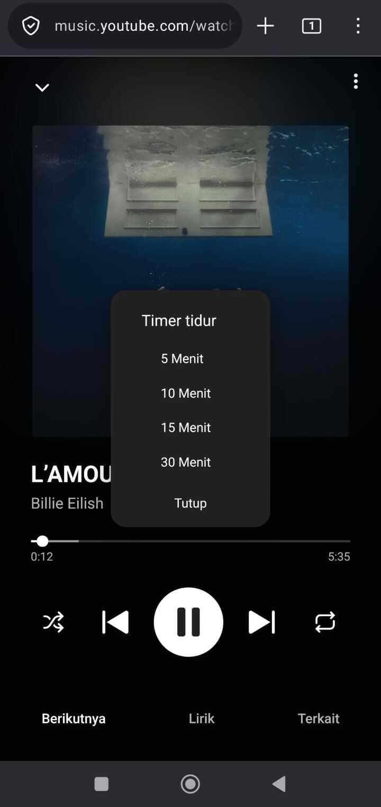
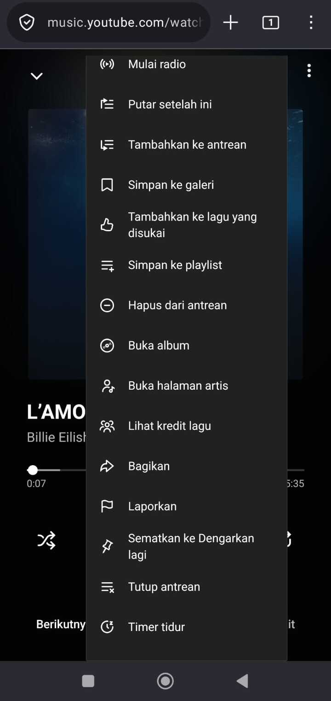

# Sleep Timer for YouTube Music

A powerful JavaScript userscript that adds a sleep timer feature to YouTube Music. Perfect for falling asleep while listening to your favorite music without worrying about battery drain or unnecessary data usage.

---

## 📋 Description

This repository contains a JavaScript userscript that automatically stops playback when the timer expires. It's designed specifically for **YouTube Music users in the Indonesian region**, but works on YouTube Music globally.

The script integrates seamlessly with YouTube Music, allowing you to set sleep timers with preset durations without any complex setup required.

---

## ✨ Features

- ⏱️ **Preset Timer Options**: Choose from 5, 10, 15, or 30 minutes
- 🔒 **Auto Pause Music**: Automatically pauses music when timer expires
- 🎵 **YouTube Music Integration**: Works directly within YouTube Music player
- 🌐 **Indonesian UI Support**: Optimized for Indonesian region users
- 💻 **Simple & Lightweight**: Minimal performance impact
- 🎯 **Easy Access**: Quick access through context menu

---

## 🖼️ Screenshots

### Timer Options Menu
Here's the sleep timer interface showing different time duration options:

### Menu Integration
The timer option is integrated into YouTube Music's menu for easy access:

---

## 🚀 Installation

### Prerequisites
- A modern web browser (Chrome, Firefox, Edge, etc.)
- Tampermonkey or any userscript manager installed

### Steps

1. **Install a Userscript Manager**
   - [Tampermonkey](https://www.tampermonkey.net/) (Recommended)
   - [Greasemonkey](https://www.greasespot.net/)
   - [Violentmonkey](https://violentmonkey.github.io/)

2. **Install the Script**
   - Copy the script from `sleeptimer-v2.js`
   - Paste it into your userscript manager's new script editor
   - Save the script

3. **Visit YouTube Music**
   - Go to [music.youtube.com](https://music.youtube.com)
   - The sleep timer will automatically be available

---

## 💡 How to Use

1. **Open YouTube Music** and start playing your favorite track
2. **Access the Menu** on YouTube Music player
3. **Find "Timer tidur"** (Sleep Timer) option in the menu
4. **Select Your Desired Duration**:
   - 5 Minutes
   - 10 Minutes
   - 15 Minutes
   - 30 Minutes
5. **Enjoy the Music** - The music will automatically pause when the timer expires

---

## 📁 Files in This Repository

- `Sleep Timer-2.0.0.js` - Main userscript (version 2.0.0)
- `sleeptimer-v2.js` - Alternative script version
- `test.js` - Testing utilities
- `timer512_white.svg` - Timer icon asset
- `screenshoot/` - Screenshot images for documentation

---

## 🌍 Regional Support

- ✅ **Indonesia**: Full support with Indonesian UI

---

## 🔒 Privacy & Security

- **No Data Collection**: This script doesn't collect any personal data
- **Local Only**: Runs entirely on your browser
- **Open Source**: Full transparency - you can inspect the code
- **Safe**: No external dependencies or network requests

---

## 🤝 Contributing

Found a bug or have a suggestion? Feel free to:
1. Fork this repository
2. Create a feature branch
3. Make your changes
4. Submit a pull request

---

## 📝 License

This project is open source and available for personal use.

---

## 🐛 Troubleshooting

### Script Not Working?
- Ensure Tampermonkey/userscript manager is enabled
- Check that JavaScript is enabled in your browser
- Try refreshing the YouTube Music page
- Clear browser cache if needed

### Timer Not Appearing?
- Verify the script is properly installed
- Check browser console for errors (F12 → Console)
- Try disabling other userscripts temporarily
- Update your userscript manager

---

## 📞 Support

For issues or questions:
1. Check existing issues on GitHub
2. Create a new issue with detailed description
3. Include browser type and version

---

**Made for Music Lovers** 🎵

*Enjoy uninterrupted music with the Sleep Timer for YouTube Music*
